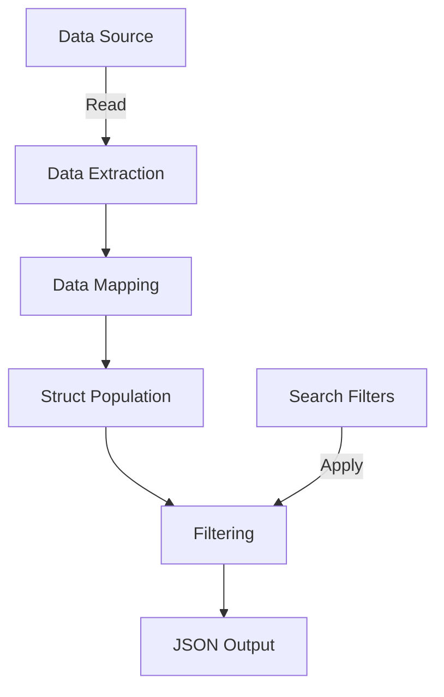
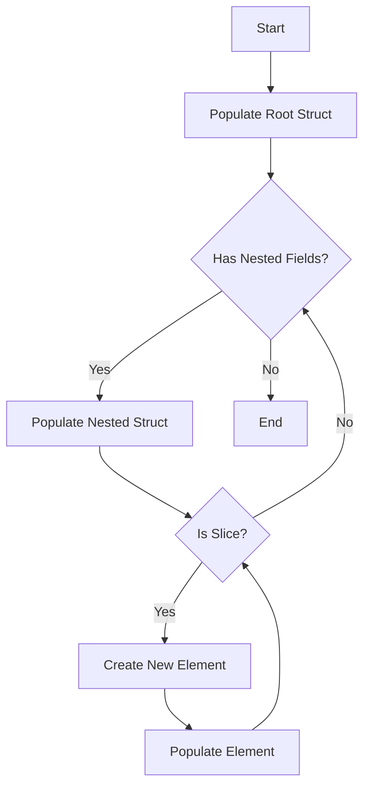
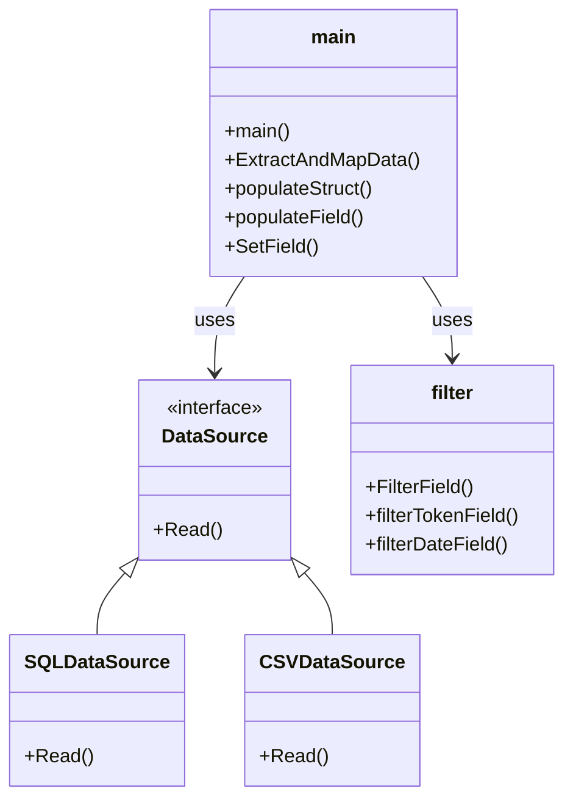
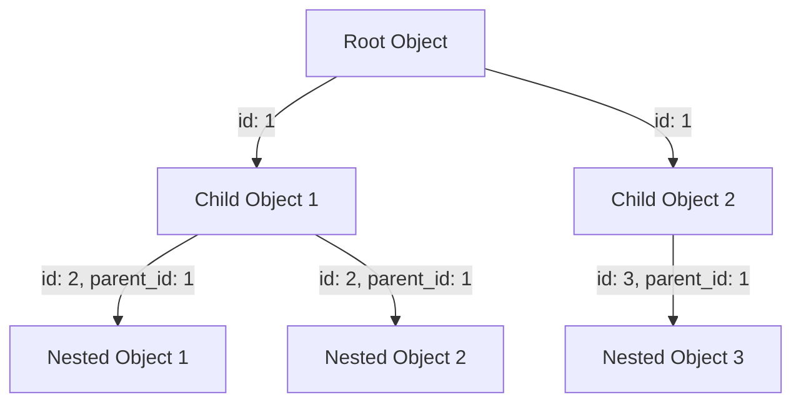
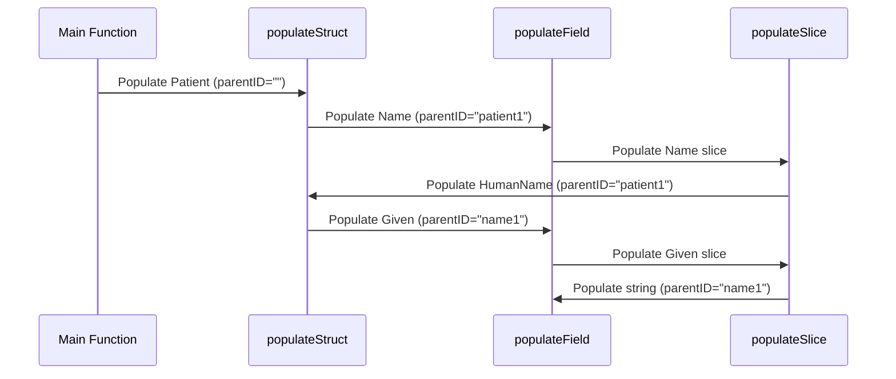

# FHIR Data Processing System Explanation

## Overview

This document explains the structure and functionality of a FHIR data processing system implemented in Go. The system is designed to extract data from various sources, map it to FHIR structures, and apply filters before outputting the result as JSON.

## System Architecture

The high-level architecture of the system can be visualized as follows:



## Key Components

### 1. Data Source

The system supports two types of data sources: SQL and CSV. This flexibility is achieved through the `DataSource` interface:

```go
type DataSource interface {
    Read() (map[string][]map[string]interface{}, error)
}
```

- **SQL Data Source**: Uses a database connection and SQL query to fetch data.
- **CSV Data Source**: Reads data from CSV files based on a mapping configuration.

### 2. Data Extraction

The `Read()` method of each data source implementation extracts data and returns it in a common format: `map[string][]map[string]interface{}`. This allows for a unified approach to handling data regardless of the source.

### 3. Data Mapping

For CSV data sources, a `CSVMapper` is used to define how CSV fields map to FHIR fields. This mapping is loaded from a JSON configuration file.

### 4. Struct Population

The `populateStruct` function recursively populates a Go struct (representing a FHIR resource) with the extracted data. It handles nested structures and slices.



### 5. Filtering

The `FilterField` function applies search filters to the populated structs. It supports different types of filters (e.g., token, date) and can handle various FHIR data types (e.g., Identifier, CodeableConcept, Coding).

### 6. JSON Output

Finally, the populated and filtered struct is converted to JSON format for output.

## Code Structure

The main components of the code are organized as follows:



## Key Features

1. **Flexibility**: The code can handle different data sources and FHIR resources.
2. **Configurability**: CSV mappings and search filters can be defined externally.
3. **Recursion**: The struct population process handles nested structures recursively.
4. **Type Handling**: The code includes logic to handle various Go and FHIR data types.
5. **Error Handling**: There's extensive error checking and logging throughout the code.

## Nested Structure Population

The system uses `id` and `parent_id` fields to establish relationships between objects in a nested structure:



The `populateStruct` and `populateSlice` functions use these fields to correctly place data within the nested structure:

1. They check if the `parent_id` of the current row matches the `parentID` passed to the function.
2. They extract the `id` of the current struct (if it exists).
3. When populating nested fields, they pass this `id` as the `parentID` for the next level of nesting.

Here's a step-by-step example of populating a Patient resource with nested fields:



This approach allows the code to correctly populate complex nested structures while maintaining the relationships between different levels of the hierarchy.
